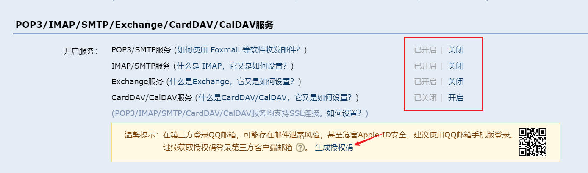
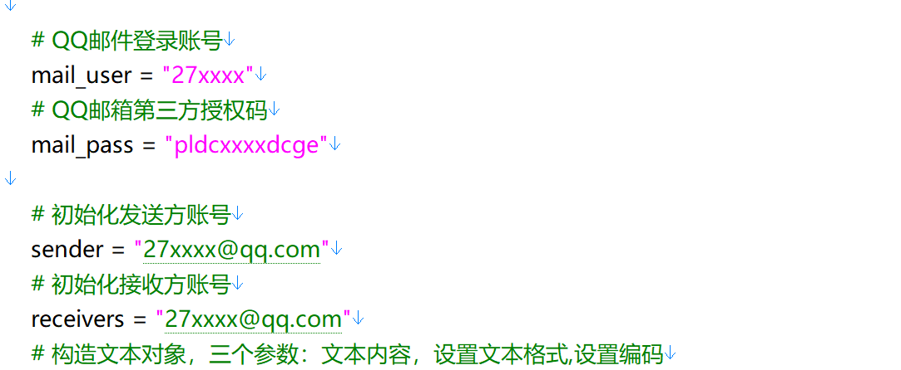
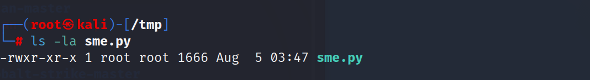
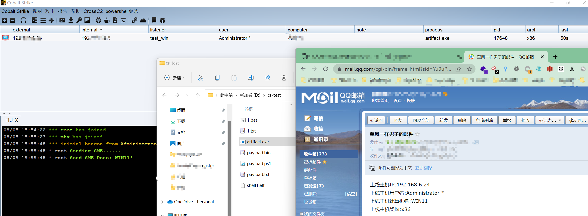

## 1.介绍

当在使用CS钓鱼时 , 可以使用这个插件增加上线qq邮件提醒功能

## 2.使用

环境

```
linux 
python version >= 3.7
```

使用步骤

1.获得qq邮箱的授权码

qq邮箱 --> 设置 --> 账户



设置成上图所示 , 并生成授权码

```
pldcxxxxdcge
```

2.修改 sme.py 文件对应的 授权码 , 发件人 , 收件人



3.把 sme.py 移动到/tmp/目录下 ( 也可以在sme.cna中设置其他路径 ) , 并设置可以执行的属性



4.运行cs服务端 , 使用服务端加载sme.cna插件

```
./teamserver 192.168.6.157 qaz
```

```
chmod +x agscript 

nohup ./agscript  192.168.6.157  1234 root qaz  /root/Desktop/cobaltstrike4.3-sz/script/other_script/sme.cna &

nohup ./agscript cs的ip cs的端口 任意用户名 密码 插件路径 &
```

5.运行cs客户端 , 生成木马上线



成功收到qq邮件提示

## 3.免责声明🧐

本工具仅面向合法授权的企业安全建设行为，如您需要测试本工具的可用性，请自行搭建靶机环境。

在使用本工具进行检测时，您应确保该行为符合当地的法律法规，并且已经取得了足够的授权。请勿对非授权目标进行扫描。

如您在使用本工具的过程中存在任何非法行为，您需自行承担相应后果，我们将不承担任何法律及连带责任
